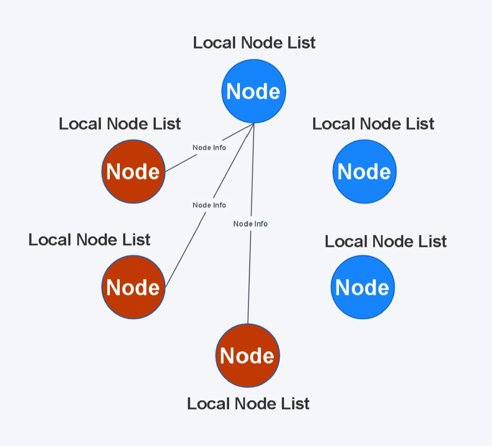

# PekoNode

## 一个基于Golang整合UDP实现的Gossip协议工具包

***

### 实现原理

* 每个节点都有一个本地节点列表NodeList。
* 每个节点的后台同步协程定时将节点信息封装成心跳数据包，并广播给集群中部分未被传染的节点。
* 其他节点接收到心跳数据包后，更新自己的本地节点列表NodeList，再将该心跳数据包广播给集群中的其他未被传染的节点。
* 重复前一个广播步骤，直至所有节点都被传染，本次心跳广播停止。
* 如果本地节点列表NodeList中，存在超时未发送心跳更新的节点，则删除该超时节点数据。

***

### 导入包
```
go get github.com/dpwgc/pekonode
```

***

### 使用方法
```
//启动一个节点
func node() {
	//配置该节点的本地节点列表nodeList参数
	nodeList := gossip.NodeList{
		Amount:     3,				//单次广播传染的最大节点数量
		Cycle:      8,				//心跳数据包发送周期，每Cycle秒广播一次心跳
		Buffer:     10,				//UDP监听缓冲区，节点数量较多时可适当增大
		Timeout:    30,				//节点超时下线时间，当一个节点超过Timeout秒没发送心跳数据包，则在本地节点列表中删除该节点
		ListenAddr: "0.0.0.0",		//UDP监听地址，用于接收其他节点发来的心跳数据包，填"0.0.0.0"即可，内网环境则填"127.0.0.1"
		ListenPort: 8000,			//UDP监听端口，与下面的本地节点端口相同即可
		IsPrint:    true,
	}

	//创建本地节点列表，传入本地节点信息
	nodeList.New(gossip.Node{
		Addr: "0.0.0.0",		//公网环境下请填写公网IP
		Port: 8000,				//与上面本地节点列表UDP监听端口相同即可
		Tag: "Test",			//节点标签，自定义填写，可以填一些节点基本信息
	})

	//往本地节点列表中添加新的节点信息，可添加多个节点，本地节点将会与这些新节点同步信息
	nodeList.Set(gossip.Node{
		Addr: "0.0.0.0",
		Port: 9999,
		Tag: "Hello",
	})
	nodeList.Set(gossip.Node{
		Addr: "0.0.0.0",
		Port: 7777,
		Tag: "Hi",
	})

	//加入Gossip集群
	nodeList.Join()
}
```

***

### 简单示例

```
package main

import (
	"github.com/dpwgc/pekonode/gossip"
	"time"
)

//简单示例
func main()  {

	//先启动节点A（初始节点）
	nodeA()

	//延迟3秒
	time.Sleep(3*time.Second)

	//同时启动节点B和节点C
	nodeB()
	nodeC()

	//延迟10秒
	time.Sleep(10*time.Second)

	//启动节点D
	nodeD()

	for {
		time.Sleep(10*time.Second)
	}
}

//节点A（初始节点）
func nodeA() {
	//配置节点A的本地节点列表nodeList参数
	nodeList := gossip.NodeList{
		Amount:     3,				//单次广播传染的最大节点数量
		Cycle:      8,				//心跳数据包发送周期，每Cycle秒广播一次心跳
		Buffer:     10,				//UDP监听缓冲区，节点数量较多时可适当增大
		Timeout:    30,				//节点超时下线时间，当一个节点超过Timeout秒没发送心跳数据包，则在本地节点列表中删除该节点
		ListenAddr: "0.0.0.0",		//UDP监听地址，用于接收其他节点发来的心跳数据包，填"0.0.0.0"即可，内网环境则填"127.0.0.1"
		ListenPort: 8000,			//UDP监听端口，与下面的本地节点端口相同即可
		IsPrint:    true,
	}

	//创建本地节点列表，传入本地节点信息
	nodeList.New(gossip.Node{
		Addr: "0.0.0.0",		//公网环境下请填写公网IP
		Port: 8000,				//与上面本地节点列表UDP监听端口相同即可
		Tag: "A",				//节点标签，自定义填写，可以填一些节点基本信息
	})

	//本地节点加入Gossip集群，本地节点列表与集群中的各个节点所存储的节点列表进行数据同步
	nodeList.Join()
}

//节点B
func nodeB() {
	//配置节点B的本地节点列表nodeList参数
	nodeList := gossip.NodeList{
		Amount:     3,
		Cycle:      8,
		Buffer:     10,
		Timeout:    30,
		ListenAddr: "0.0.0.0",
		ListenPort: 8001,
		IsPrint:    true,
	}

	//创建本地节点列表，传入本地节点信息
	nodeList.New(gossip.Node{
		Addr: "0.0.0.0",
		Port: 8001,
		Tag: "B",
	})

	//将初始节点A的信息加入到B节点的本地节点列表当中
	nodeList.Set(gossip.Node{
		Addr: "0.0.0.0",
		Port: 8000,
		Tag: "A",			//将节点A的信息添加进节点B的本地节点列表
	})

	//调用Join后，节点B会自动与节点A进行数据同步
	nodeList.Join()
}

//节点C
func nodeC() {
	nodeList := gossip.NodeList{
		Amount:     3,
		Cycle:      8,
		Buffer:     10,
		Timeout:    30,
		ListenAddr: "0.0.0.0",
		ListenPort: 8002,
		IsPrint:    true,
	}

	nodeList.New(gossip.Node{
		Addr: "0.0.0.0",
		Port: 8002,
		Tag: "C",
	})

	//也可以在加入集群之前，在本地节点列表中添加多个节点信息
	nodeList.Set(gossip.Node{
		Addr: "0.0.0.0",
		Port: 8000,
		Tag: "A",			//将节点A的信息添加进节点C的本地节点列表
	})
	nodeList.Set(gossip.Node{
		Addr: "0.0.0.0",
		Port: 8001,
		Tag: "B",			//将节点B的信息添加进节点C的本地节点列表
	})

	//在加入集群后，节点C将会与上面的节点A及节点B进行数据同步
	nodeList.Join()
}

//节点D
func nodeD() {
	nodeList := gossip.NodeList{
		Amount:     3,
		Cycle:      8,
		Buffer:     10,
		Timeout:    30,
		ListenAddr: "0.0.0.0",
		ListenPort: 8003,
		IsPrint:    true,
	}

	nodeList.New(gossip.Node{
		Addr: "0.0.0.0",
		Port: 8003,
		Tag: "D",
	})

	nodeList.Set(gossip.Node{
		Addr: "0.0.0.0",
		Port: 8001,
		Tag: "B",
	})

	nodeList.Join()

	//延迟60秒
	time.Sleep(60*time.Second)

	//停止节点D的心跳广播服务（节点D暂时下线）
	nodeList.Stop()

	//延迟60秒
	time.Sleep(60*time.Second)

	//因为之前节点D下线，D的本地节点列表无法接收到各节点的心跳数据包，列表被清空
	//所以要先往D的本地节点列表中添加一些集群节点，再调用Start()重启节点D的同步工作
	nodeList.Set(gossip.Node{
		Addr: "0.0.0.0",
		Port: 8001,
		Tag: "B",		//这里添加节点B的信息
	})

	//重启节点D的心跳广播服务（节点D重新上线）
	nodeList.Start()
}
```

***
### 模板说明
```
// NodeList 节点列表
type NodeList struct {
	nodes   sync.Map 		//节点集合（key为Node结构体，value为节点最近更新的秒级时间戳）
	Amount  int      		//每次给多少个节点发送同步信息
	Cycle   int64    		//同步时间周期（每隔多少秒向其他节点发送一次列表同步信息）
	Buffer  int      		//接收缓冲区大小
	Timeout int64    		//单个节点的过期删除界限（多少秒后删除）

	localNode Node 			//本地服务节点

	ListenAddr string 		//本地节点列表更新监听地址（这两一般与本地节点Node设置相同）
	ListenPort int    		//本地节点列表更新监听端口

	status map[int]bool 	//本地节点列表更新状态（map[1] = true：正常运行，map[1] = false：停止同步更新）

	IsPrint bool 			//是否打印列表同步信息到控制台
}

// Node 节点
type Node struct {
	Addr string 		//节点IP地址（公网环境下填公网IP）
	Port int    		//端口号
	Tag  string 		//节点标签（可以写一些基本信息）
}
```

***

### 函数说明
* nodeList 本地节点列表
##### New 创建本地节点列表
```
func (nodeList *NodeList) New(localNode Node) 
```
* localNode 本地节点信息

##### Join 加入集群
```
func (nodeList *NodeList) Join() 
```

##### Stop 停止广播心跳
```
func (nodeList *NodeList) Stop() 
```

##### Start 重新开始广播心跳
```
func (nodeList *NodeList) Start() {
```

##### Set 向本地节点列表中加入其他节点信息
```
func (nodeList *NodeList) Set(node Node) 
```
* node 要添加进本地节点列表的某个集群节点信息

##### Get 获取本地节点列表
```
func (nodeList *NodeList) Get() []Node 
```